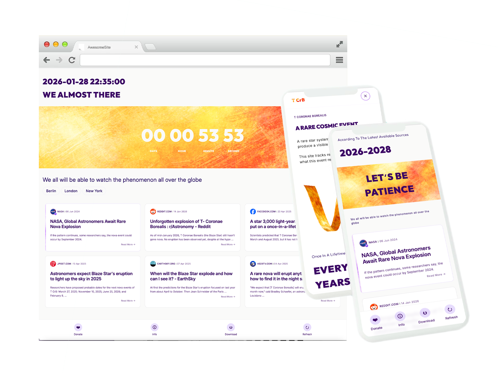

# T CrB Nova Tracker

T CrB Nova Tracker is a personal experimental web application built to follow predictions and updates related to **T Coronae Borealis (the “Blaze Star”)**, a rare recurrent nova expected to erupt again in the coming years.

As an amateur astronomy enthusiast, I wanted a simple way to track the evolving forecasts and related scientific updates in one place because I genuinely hope to witness this phenomenon with my own eyes.

---

## What is T Coronae Borealis?

T Coronae Borealis (T CrB) is a recurrent nova system located in the constellation Corona Borealis. It has erupted only a few times in recorded history, and current research suggests another eruption may occur in the near future.

Observing such an event is rare (once in a life time 80 year event), unpredictable, and highly dependent on timing, location, and visibility conditions which makes it especially fascinating to follow.

---

## Why I Built This Project (Technical Perspective)

This is a **personal, experimental project** built as a focused challenge: to design and implement a complete product in **under 100 hours of work**, combining **UI design, frontend code, and AI-assisted workflows**.

The project explores how far a single creator can go by blending:

* Hands-on **design-to-code** thinking
* Practical use of **AI tools** as collaborators (analysis, iteration, exploration)
* Rapid decision-making within clear constraints

Key goals:

* Practicing the integration of **AI-assisted analysis** with real-world data
* Experimenting with **web search pipelines** driven by AI
* Building a modern frontend using **React + Vite**
* Styling and layout experimentation using **Tailwind CSS**
* Exploring **PWA (Progressive Web App)** installation and mobile behavior

There is no commercial intent behind this project. It is designed to evolve gradually as an exploration space for ideas, tools, and patterns.

---

## How the Application Works

At its core, the application provides a single place to follow **predictions, updates, and information** about the T CrB nova, presented in a clear and accessible way.

It combines curated sources, estimated timelines, and UI states that adapt as new information becomes available.

### Visual Reference

This mockup illustrates the intended visual direction and overall structure of the application.

### User Modes

* **Anonymous mode**
  Users can browse predictions and articles without sharing any location data.

* **Location-enabled mode**
  If a user allows geolocation, the app can later highlight regions on Earth that may have better visibility conditions for observing the nova, prioritizing areas closest to the user.

### Predictions & Updates Logic

* When **no precise eruption date** is available:

  * The app displays an **estimated time window**
  * Relevant articles and sources are shown to indicate where the estimation comes from

* When a **precise date becomes available**:

  * A **live countdown timer** is displayed
  * Articles and sources that support the precise timing are prioritized and shown alongside the countdown

Sources are always displayed, with **preference given to sources I personally consider reliable**, such as official space agencies and established astronomy organizations.

---

## Articles & Data Sources

The app continuously searches for updates related to T CrB:

* Forecasts
* Scientific discussions
* Observational updates

Because this project relies exclusively on **free APIs and free data sources**, searches are rate-limited:

* Manual refresh is available **once every 30 minutes**
* This limitation is intentional to avoid unnecessary costs

---

## Mobile Installation (PWA)

The application can be installed on mobile devices as a **Progressive Web App**:

* **Android (Chrome / Edge)**
  Users can install the app directly and follow updates like a native application.

* **iOS (Safari)**
  Installation is available via *Share → Add to Home Screen*.

This allows users to follow the phenomenon closely from a personal mobile device.

---

## Donations & Project Support

If you find this project interesting or useful, you can support its continued development here:

☕ **Buy Me a Coffee**
[https://buymeacoffee.com/nav87pow](https://buymeacoffee.com/nav87pow)

Contributions help cover ongoing experimentation time, and future improvements to the project. Supporting the project is completely optional — all core features remain free and open.

---

## Debug / Countdown Preview for Reviewers

For reviewers or recruiters who want to see the **countdown UI** without waiting for a real astronomical event:

**Countdown Debug Mode**
`tcrb.netlify.app/?mock=countdown`

---

## Project Status & Design Notes

This project is considered **feature-complete for its current experimental scope**.

### Open Project & File Access

This is an **open project**:

* The **source code** is publicly available on GitHub
* The **design files** will be published publicly on **Figma**

Both are intended to be accessible for review, learning, and reuse.

### Responsive Design Scope

* The interface was **designed mobile-first** and optimized primarily for **smartphone screens**.
* Desktop responsiveness was implemented at a **minimal, illustrative level only**, intended to demonstrate layout behavior rather than provide a fully polished desktop experience.

### License

This project is licensed under the MIT License — see the [LICENSE](LICENSE) file for details.  
You are free to download, use, and modify the source code, including for commercial purposes, provided that attribution is given to the original author.

